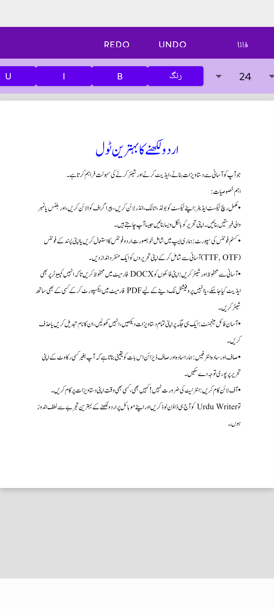

# Urdu Writer (اردو رائٹر)

[](https://opensource.org/licenses/MIT)

**Urdu Writer** ایک سادہ اور طاقتور اینڈرائڈ ایپ ہے جو صارفین کو آسانی سے اردو دستاویزات بنانے، ایڈیٹ کرنے اور شیئر کرنے کی سہولت فراہم کرتی ہے۔ یہ ایپ ایک مکمل رچ ٹیکسٹ ایڈیٹر، کسٹم فونٹس کی سپورٹ، اور DOCX/PDF میں فائلیں ایکسپورٹ کرنے کی صلاحیت کے ساتھ آتی ہے۔

یہ پروجیکٹ مکمل طور پر اوپن سورس ہے تاکہ دوسرے ڈویلپرز اس سے سیکھ سکیں اور اس میں اپنا حصہ ڈال سکیں۔

## خصوصیات (Features)

*   **مکمل رچ ٹیکسٹ ایڈیٹر:**
    *   بولڈ، اٹالک، اور انڈر لائن
    *   پیراگراف کی الائنمنٹ (دائیں، بائیں، درمیان میں)
    *   بلٹس اور نمبر والی فہرستیں
    *   ٹیکسٹ کا رنگ تبدیل کریں
    *   انڈو اور ریڈو
*   **فونٹ مینجمنٹ:**
    *   ایپ میں شامل خوبصورت اردو فونٹس
    *   ڈیوائس سے اپنے فونٹس (TTF/OTF) شامل اور حذف کریں
*   **فائل مینجمنٹ:**
    *   نئی دستاویزات بنائیں
    *   موجودہ فائلوں کو کھولیں، ان کا نام تبدیل کریں، اور حذف کریں
*   **ایکسپورٹ کے اختیارات:**
    *   اپنی دستاویزات کو `.docx` فارمیٹ میں محفوظ کریں
    *   پروفیشنل شیئرنگ کے لیے `.pdf` فائل بنائیں
*   **صاف اور استعمال میں آسان انٹرفیس**

## اسکرین شاٹس (Screenshots)

<p align="center">
  
  &nbsp; &nbsp; &nbsp;
  
  &nbsp; &nbsp; &nbsp;
  
  &nbsp; &nbsp; &nbsp;
  
</p>

## شروع کریں (Getting Started)

اس پروجیکٹ کو اپنے مقامی مشین پر سیٹ اپ کرنے کے لیے، ان اقدامات پر عمل کریں:

1.  **ریپوزٹری کلون کریں:**
    ```sh
    git clone https://github.com/AppsFromSaad/UrduWriter.git
    ```

2.  **Android Studio میں کھولیں:**
    *   Android Studio لانچ کریں۔
    *   `File` -> `Open` کو منتخب کریں اور کلون کی گئی ڈائرکٹری پر جائیں۔
3.  **پروجیکٹ سنک کریں:**
    *   Android Studio خود بخود گریڈل انحصار کو ڈاؤن لوڈ اور پروجیکٹ کو سنک کر دے گا۔

## حصہ ڈالیں (Contributing)

ہم اس پروجیکٹ میں حصہ ڈالنے والوں کا خیرمقدم کرتے ہیں! اگر آپ اس ایپ کو بہتر بنانے میں مدد کرنا چاہتے ہیں، تو براہ کرم:

1.  اس ریپوزٹری کو **فورک** کریں۔
2.  اپنی تبدیلیوں کے لیے ایک نئی **برانچ** بنائیں (`git checkout -b feature/AmazingFeature`)۔
3.  اپنی تبدیلیاں **کومٹ** کریں (`git commit -m 'Add some AmazingFeature'`)۔
4.  اپنی برانچ کو **پش** کریں (`git push origin feature/AmazingFeature`)۔
5.  ایک **پل ریکوسٹ** (Pull Request) کھولیں۔

**اہم نوٹ:** براہ کرم اپنی `keystore.properties` فائل یا `.jks` کی اسٹور فائل کو کبھی بھی پبلک ریپوزٹری میں پش نہ کریں۔ یہ فائلیں `.gitignore` میں پہلے سے شامل ہیں تاکہ انہیں محفوظ رکھا جا سکے۔

## لائسنس (License)

یہ پروجیکٹ MIT لائسنس کے تحت تقسیم کیا گیا ہے۔ مزید معلومات کے لیے `LICENSE` فائل دیکھیں۔
